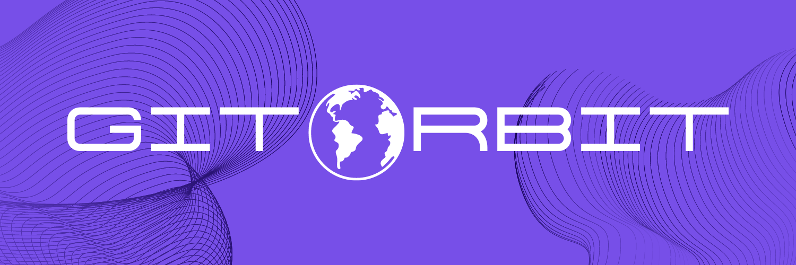

# gitorbit

# ⚡️ Contribution Guidelines

Wanna contribute to our project, but don't know how to start? Check out our [**contributing guidelines**](https://github.com/devstrons/gitorbit/blob/main/CONTRIBUTING.md) for how to make your first contribution here.

## 🛠 Building

- `npm install` — Installs all dependencies
- `npm run dev` — Starts the development server
- `npm run build` — Builds the project, for deployment

> **YouTube** <a href="https://www.youtube.com/c/devstrons" target="_blank" rel="noopener">@devstrons</a> &nbsp;&middot;&nbsp; **Instagram** <a href="https://www.instagram.com/devstrons" target="_blank" rel="noopener">@devstrons</a> &nbsp;&middot;&nbsp; **Discord** <a href="https://dsc.gg/devstrons" target="_blank" rel="noopener">DEVSTR😊NS'</a> &nbsp;&middot;&nbsp; **Twitter** <a href="https://twitter.com/devstrons" target="_blank" rel="noopener">@devstrons</a>
